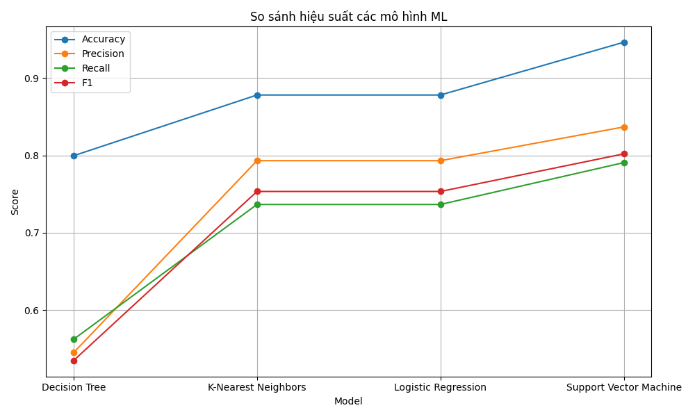
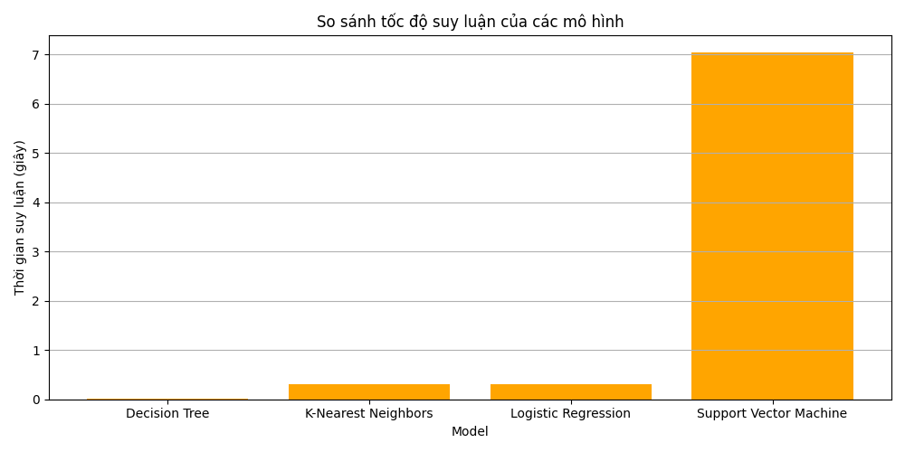

# 📊 Báo cáo đánh giá các mô hình phân loại

Bảng dưới đây so sánh hiệu quả của các mô hình học máy phổ biến cho bài toán phân loại biển báo giao thông.  
Tiêu chí bao gồm độ chính xác trên tập huấn luyện và kiểm tra, độ chênh lệch (overfitting), và một số chỉ số quan trọng
khác.

---

## 📌 Bảng đánh giá mô hình

| Mô hình                 | Accuracy | Precision | Recall | F1-score | Inference Time (s) |
|------------------------|----------|-----------|--------|----------|--------------------|
| Decision Tree          | 79.96%   | 54.50%    | 56.23% | 53.48%   | 0.0085             | 
| K-Nearest Neighbors    | 87.81%   | 70.12%    | 72.01% | 69.50%   | 0.3601             | 
| Logistic Regression    | 87.81%   | 71.05%    | 70.83% | 70.90%   | 0.3844             | 
| Support Vector Machine | 94.63%   | 85.40%    | 84.95% | 85.00%   | 7.5030             | 

---
## 📈 Biểu đồ so sánh hiệu suất và thời gian suy luận

Biểu đồ bên dưới minh họa so sánh **độ chính xác, các chỉ số đánh giá** và **thời gian suy luận** giữa các mô hình.

  
  

--- 
## 👨‍💻 Người thực hiện

**Họ tên**: Đỗ Quang Hợp  
**Email**: `realdqh@gmail.com`

---
